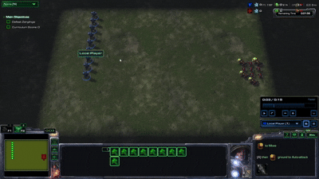
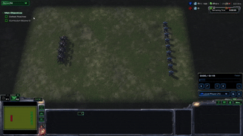

# SC-TPG: Shared-Control TPG with Ecology-Conditioned Memory for StarCraft II Micromanagement

<p align="center">
  
</p>

<p align="center">
  <em>The framework of Shared-Control TPG with Ecology-Conditioned Memory for StarCraft II Micromanagement.</em>
</p>

---

## Overview

This repository contains the source code for SC-TPG, a shared-control Tangled Program Graph framework for training multi-agent policies in StarCraft II mini-task environments.

The project studies whether a single evolved policy can control multiple units under different local observations, allowing coordinated and diverse behaviors to emerge without assigning a separate policy to each unit. The environment is built on top of the StarCraft II API through the Python package [`python-sc2`](https://github.com/BurnySc2/python-sc2).

The code was developed for research on evolutionary learning, multi-agent control, and StarCraft II micro-combat tasks.

---

## Key Features

* Shared-control policy learning with Tangled Program Graphs.
* Multi-agent StarCraft II mini-task training.
* Support for local unit observations and decentralized behavior execution.
* Optional combat memory for improving robustness under noisy observations.
* Checkpoint-based training and resume support.
* Custom mini-task maps designed to reduce unnecessary environment restarts during training.

---

## Task Demonstrations

The following examples show the StarCraft II mini-task combat scenarios used in this project.

### DefeatZerglingsAndBanelings

<p align="center">
  
</p>

This task requires Marine agents to fight against Zerglings and Banelings. The scenario emphasizes short-range combat, threat avoidance, and coordinated target selection under shared-control policy execution.

### DefeatRoaches

<p align="center">
  
</p>

This task requires Marine agents to fight against Roaches. Compared with the Zergling and Baneling scenario, this setting involves more durable enemy units and requires sustained combat behavior over a longer engagement.


## Repository Structure

```text
.
├── actions/   # Task-specific action definitions for Marine agents
├── assets/    # Figures and images used in the README
├── configs/   # Experiment configurations
├── features/  # Task-specific observation feature definitions
├── policies/  # Policy variants, such as no-memory and combat-memory policies
├── rewards/   # Task-specific reward functions
├── sc2env/    # StarCraft II environment interaction logic for different tasks
├── tasks/     # Task configuration files and task-level settings
├── tpg/       # Tangled Program Graph implementation
├── training/  # Training utilities, checkpointing, and experiment management
├── WM/        # World model components used to accelerate training
├── requirements.txt     # Python dependencies
├── train_once.py        # Entry point for running a single training job
├── run_train.sh         # SLURM script for large-scale training on a server
└── README.md
```

The repository is organized around task-specific modular components. Actions, observations, rewards, environment interactions, and task configurations are separated into different folders so that new StarCraft II mini-tasks can be added or modified more easily. Policy variants are implemented separately, allowing experiments with different memory mechanisms such as no-memory and combat-memory settings.


---

## Installation

### 1. Clone the Repository

```bash
git clone https://github.com/ramsayxiaoshao/SC-TPG.git
cd SC-TPG
```

### 2. Create a Python Environment

We recommend using a virtual environment.

#### Windows

```powershell
python -m venv env_sc2
.\env_sc2\Scripts\activate
python -m pip install --upgrade pip
pip install -r requirements.txt
```

#### Linux

```bash
python3 -m venv env_sc2
source env_sc2/bin/activate
python -m pip install --upgrade pip
pip install -r requirements.txt
```

Thanks to burnysc2, this project uses [`burnysc2`](https://pypi.org/project/burnysc2/), which provides the `sc2` Python package used to communicate with StarCraft II.

---

## StarCraft II Setup

This project requires a working StarCraft II installation.

### Windows

1. Install StarCraft II from the Battle.net launcher.
2. Locate your StarCraft II installation directory. The default path is usually:

```text
C:\Program Files (x86)\StarCraft II
```

3. Set the `SC2PATH` environment variable if the game is installed in a custom location:

```powershell
$env:SC2PATH="C:\Program Files (x86)\StarCraft II"
```

You can also set it permanently through Windows Environment Variables.

---

### Linux

For Linux servers or HPC clusters, the recommended option is to use the official headless StarCraft II Linux package from Blizzard's `s2client-proto` resources.

After extracting the Linux package, set:

```bash
export SC2PATH=/path/to/StarCraftII
export SC2_PATH=$SC2PATH
```

For example:

```bash
export SC2PATH=$HOME/StarCraftII
export SC2_PATH=$SC2PATH
```

The expected directory structure is:

```text
StarCraftII/
├── Versions/
├── Maps/
├── Replays/
└── ...
```

The executable should be located under:

```text
StarCraftII/Versions/*/SC2_x64
```

---

## Maps

StarCraft II maps should be placed under:

```text
$SC2PATH/Maps/mini_games
```

or, on Windows:

```text
C:\Program Files (x86)\StarCraft II\Maps\mini_games
```

### Custom Mini-Task Maps

This project uses modified mini-task maps for faster training.

In the original mini-task setup, the game environment may terminate and restart when all Marines die for some combat tasks. This can introduce unnecessary overhead during long training runs. The modified maps in this project are designed to reduce such restart overhead and improve training efficiency.

Download the custom maps here:

```text
https://drive.google.com/drive/folders/1Z_YNCRE63m5xeXb4hq-L4hqeTnll4qoG?usp=sharing
```

After downloading, copy the map files into:

```text
$SC2PATH/Maps/mini_games
```

For example:

```bash
cp -r ModifiedMiniTasks $SC2PATH/Maps/mini_games
```

On Windows, copy the map folder manually into:

```text
C:\Program Files (x86)\StarCraft II\Maps\mini_games
```

---

## Running Training

After installing the Python environment and configuring StarCraft II, run:

```bash
python -u train_once.py
```

If the code uses configurable task names, policy names, or random seeds, you can run:

```bash
TASK_NAME=your_task_name POLICY_NAME=your_policy_name SEED=0 python -u train_once.py
```

On Windows PowerShell:

```powershell
$env:TASK_NAME="your_task_name"
$env:POLICY_NAME="your_policy_name"
$env:SEED="0"
python -u train_once.py
```

---

## Running on a SLURM Cluster

An example SLURM script is provided in:

```text
scripts/run_train.sbatch
```

Before submitting, set the following paths according to your cluster:

```bash
export SC2_MASTER=/path/to/StarCraftII
export VENV_DIR=/path/to/venv
export PROJECT_DIR=/path/to/SC-TPG
export TASK_NAME=your_task_name
export POLICY_NAME=your_policy_name
export SEED=0
```

Then submit:

```bash
sbatch scripts/run_train.sbatch
```

The SLURM script copies StarCraft II to job-local storage before training. This avoids shared-storage conflicts when multiple jobs launch StarCraft II instances at the same time.

---

## Checkpoints and Outputs

Training outputs are typically saved under directories such as:

```text
logs/
runs/
```


---

## Notes on Reproducibility

Since StarCraft II includes an external game engine, exact reproducibility may still depend on the StarCraft II version, map version, operating system, and hardware environment.

---

## Requirements

The Python dependencies are listed in:

```text
requirements.txt
```

To regenerate the dependency file from an existing virtual environment:

```bash
python -m pip freeze --local > requirements.txt
```

On Windows, if the virtual environment is located at `env_sc2`, use:

```powershell
.\env_sc2\Scripts\python.exe -m pip freeze --local > requirements.txt
```

---


---

## Acknowledgements

This project uses the StarCraft II API through [`python-sc2`](https://github.com/BurnySc2/python-sc2). We thank the developers of the StarCraft II AI research ecosystem for maintaining tools that make StarCraft II accessible for reinforcement learning and multi-agent AI research.

The Tangled Program Graph implementation in this repository is based in part on [`PyTPG`](https://github.com/Ryan-Amaral/PyTPG) by Dr. Ryan Amaral and his team. We gratefully acknowledge his open-source implementation, which provided an important foundation for the TPG components used in this project. The original implementation has been modified and extended to support our StarCraft II shared-control training framework.

---

